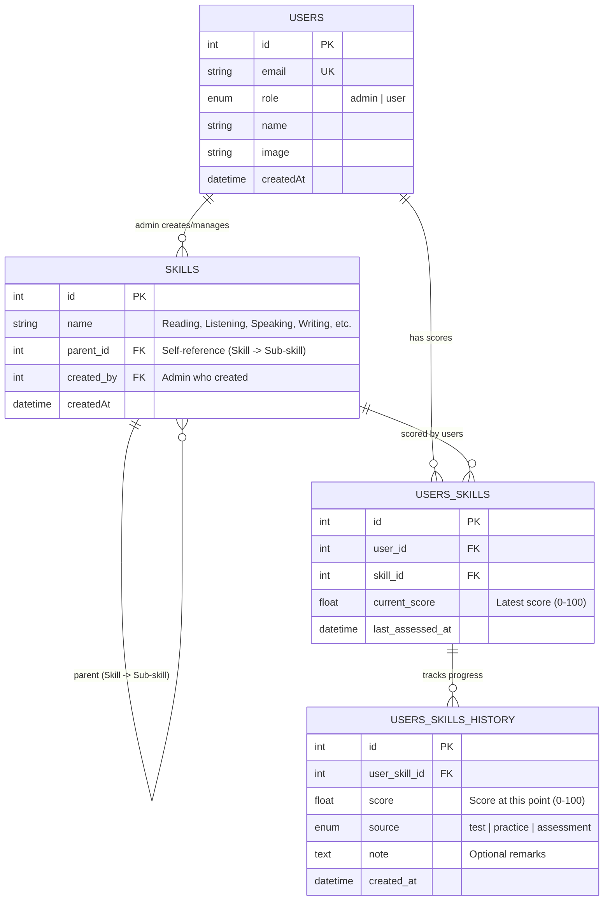

# Epic 6: Skill Management

**ID:** EPIC-6
**Status:** Planned
**Description:** Enable skill tracking with score assessment, progress history, and admin-managed skill hierarchy.

---

## Overview

Skill Management module allows admins to create and manage a hierarchical skill structure. Users can track their proficiency scores for each skill, record assessments from various sources (tests, practice, assessments), and view their progress history over time. This complements the existing flashcard learning system with comprehensive skill score tracking.

### Goals
- Allow admins to create and manage hierarchical skills
- Enable users to track their current score for each skill
- Record score history with source tracking (test/practice/assessment)
- Visualize skill progress over time
- Complement existing flashcard learning with skill assessment

### Scope
- **In Scope:** Skill CRUD (admin), user skill scores, score history tracking, progress visualization
- **Out of Scope:** AI-powered skill recommendations, integration with external assessment platforms, certifications

---

## User Stories

| ID | Name | Status | Priority | File |
|----|------|--------|----------|------|
| US-6.1 | Skill Management (Admin) | Planned | Critical | [US-6-1.md](US-6-1.md) |
| US-6.2 | View Available Skills | Planned | Critical | [US-6-2.md](US-6-2.md) |
| US-6.3 | Record Skill Score | Planned | Critical | [US-6-3.md](US-6-3.md) |
| US-6.4 | View Score History | Planned | High | [US-6-4.md](US-6-4.md) |
| US-6.5 | My Skills Dashboard | Planned | High | [US-6-5.md](US-6-5.md) |
| US-6.6 | Progress Visualization | Planned | High | [US-6-6.md](US-6-6.md) |
| US-6.7 | Skill Score Analytics | Planned | Medium | [US-6-7.md](US-6-7.md) |
| US-6.8 | Bulk Score Import | Planned | Low | [US-6-8.md](US-6-8.md) |

---

## Technical Implementation

- **Framework**: Next.js App Router
- **Database**: Cloudflare D1 (SQLite)
- **UI**: React components with existing design system

### Database Schema

### Permissions

| Actor | Action | Resource |
|-------|--------|----------|
| Admin | Create, Update, Delete | Skills |
| Admin | View | All users' skill scores |
| User | View | Available skills |
| User | Record | Own skill scores |
| User | View | Own score history |

### API Endpoints

| Method | Endpoint | Description | Access |
|--------|----------|-------------|--------|
| GET | `/api/admin/skills` | List all skills (with hierarchy) | Admin |
| POST | `/api/admin/skills` | Create skill | Admin |
| PUT | `/api/admin/skills/:id` | Update skill | Admin |
| DELETE | `/api/admin/skills/:id` | Delete skill | Admin |
| GET | `/api/admin/users/:id/skills` | View user's skill scores | Admin |
| GET | `/api/skills` | List available skills | User |
| GET | `/api/skills/:id` | Get skill details | User |
| GET | `/api/me/skills` | List my skill scores | User |
| POST | `/api/me/skills` | Add skill to track | User |
| PUT | `/api/me/skills/:skillId` | Update my skill score | User |
| DELETE | `/api/me/skills/:skillId` | Remove skill from tracking | User |
| GET | `/api/me/skills/:skillId/history` | Get score history | User |
| POST | `/api/me/skills/:skillId/history` | Record new score entry | User |

### Score Sources

| Source | Description |
|--------|-------------|
| test | Formal test or examination |
| practice | Practice session or exercise |
| assessment | Self-assessment or informal evaluation |

### Score Range

| Range | Level | Description |
|-------|-------|-------------|
| 0-20 | Beginner | Just started, minimal proficiency |
| 21-40 | Elementary | Basic understanding |
| 41-60 | Intermediate | Can apply with some guidance |
| 61-80 | Advanced | Can apply independently |
| 81-100 | Expert | Mastery level, can teach others |

### Files (Proposed)

- `src/app/api/admin/skills/route.ts` - Admin skill CRUD endpoints
- `src/app/api/admin/users/[id]/skills/route.ts` - Admin view user scores
- `src/app/api/skills/route.ts` - List available skills
- `src/app/api/me/skills/route.ts` - User skill scores endpoints
- `src/app/api/me/skills/[skillId]/history/route.ts` - Score history endpoints
- `src/app/dashboard/skills/page.tsx` - My skills dashboard
- `src/app/dashboard/skills/[id]/page.tsx` - Skill detail with history
- `src/app/admin/skills/page.tsx` - Admin skill management
- `src/components/SkillCard.tsx` - Skill with score display
- `src/components/ScoreInput.tsx` - Score recording form
- `src/components/ProgressChart.tsx` - Score history visualization
- `src/components/SkillTree.tsx` - Hierarchical skill display

---

## RICE Score Summary

| Story | Reach | Impact | Confidence | Effort | Score |
|-------|-------|--------|------------|--------|-------|
| US-6.1 | 50% | 3 | 80% | 1w | 120.0 |
| US-6.2 | 50% | 2 | 80% | 0.5w | 160.0 |
| US-6.3 | 50% | 3 | 80% | 1w | 120.0 |
| US-6.4 | 50% | 2 | 80% | 1w | 80.0 |
| US-6.5 | 50% | 2 | 80% | 1w | 80.0 |
| US-6.6 | 40% | 2 | 80% | 1w | 64.0 |
| US-6.7 | 30% | 1 | 80% | 0.5w | 48.0 |
| US-6.8 | 20% | 1 | 60% | 1w | 12.0 |

**Epic Score:** (50 × 2 × 0.8) / 6 = **13.3**

---

## Related Documents

- [CR-004: Skill Management Module](../../change-requests/CR-004-skill-management.md)
